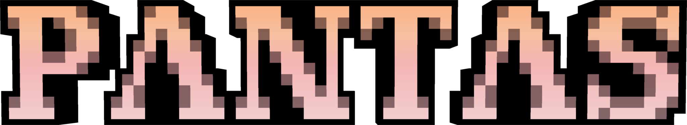

---

An opinionated Minecraft modpack crafted for modern, high-performance gameplay.

# 🎯 Variants

Pantas comes in different variants to match your specific needs and hardware capabilities. Each variant builds upon the previous one, allowing you to choose the perfect balance between performance and features.

## Minimal
- **Pure performance focus** - Essential mods for maximum FPS with core fixes only. Perfect for competitive players, lower-end hardware, or maximum performance seekers.
- Features:
  - Performance optimizations (Sodium, Lithium, C2ME)
  - Bug fixes and stability improvements

## Standard
- **OptiFine alternative** - Building on Minimal with near-complete OptiFine feature parity plus essential additions. Perfect for most players, OptiFine users switching to Fabric, or anyone wanting the standard experience.
- Features:
  - Everything in Minimal, plus:
  - Shader support (Iris)
  - Connected textures (Continuity) 
  - Dynamic lighting and zoom capabilities
  - Enhanced UI and mod management

## Which Variant to Choose?

- **New to Minecraft modpacks?** → **Standard** variant
- **OptiFine user switching to Fabric?** → **Standard** variant  
- **Want maximum performance?** → **Minimal** variant

# 📋 Release Versioning

Pantas follows a structured versioning approach to help you understand what's changed between releases.

## Modpack Version Numbers

Each release uses this pattern: **Minecraft Version** + **Modpack Version**

- **Major** `?.x.x` - Significant changes like new mod additions or removals
- **Minor** `x.?.x` - Configuration updates, setting adjustments, or smaller mod changes  
- **Patch** `x.x.?` - Mod updates with minimal impact, bug fixes, or maintenance

Example Version Format: `1.21.4-1.0.0`

## New Minecraft Versions

When Minecraft updates (like `1.21.4` → `1.21.5`), the modpack version resets to `1.0.0` since mod compatibility often requires starting fresh.

# 🛠️ Support & Feedback

Found a bug, have a suggestion, or need help with an issue? The best way to get support is on our GitHub.

## Reporting Bugs & Suggesting Features

Please open an issue on our [GitHub issue tracker](https://github.com/muhdfdeen/pantas/issues) for all bug reports, questions, and suggestions.